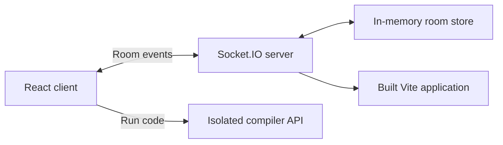

# CoDevTogether

CoDevTogether is a real-time collaborative coding workspace built with React 19, Vite, Express, and Socket.IO. Create an invite link, edit code with teammates, share problem notes, chat, track presence, and send code to an external compiler service without leaving the room.

**Live application:** [codev.abhishekchorotiya.xyz](https://codev.abhishekchorotiya.xyz)

## Features

- Shared CodeMirror editor with live room synchronization
- JavaScript, Python, Java, and C++ language modes
- Shared problem statement and notes
- Real-time participant presence and reconnect handling
- Room chat and server-generated activity messages
- Remote compilation with timeout and error reporting
- Blue, red, and dark themes
- Responsive, keyboard-accessible interface
- Lazy-loaded room and editor bundles

## Technology

| Area | Stack |
| --- | --- |
| UI | React 19, React Router, Tailwind CSS, Lucide |
| Editor | CodeMirror 6 |
| Build | Vite 8 |
| Server | Node.js, Express 5 |
| Collaboration | Socket.IO 4 |
| Tests | Vitest, Testing Library, jsdom |
| Quality | ESLint, npm audit |

## How it works



The server binds each socket to its validated room and keeps one authoritative document snapshot while that room is active. A newly joined participant receives that snapshot once, avoiding peer-to-peer synchronization races. Code edits use last-write-wins synchronization; a CRDT would be the next step for conflict-free simultaneous editing.

## Requirements

- Node.js 20.19 or newer
- npm 10 or newer
- An HTTP compiler service compatible with the request described below

## Quick start

Install dependencies and create the frontend environment file:

```bash
npm install
cp .env.example .env
```

Start the collaboration server:

```bash
npm run server
```

In another terminal, start Vite:

```bash
npm run dev
```

Open `http://localhost:5173`. During development, Vite proxies Socket.IO traffic to `http://localhost:5000`.

## Environment variables

### Frontend

Vite reads these values from `.env` when it starts:

| Variable | Required | Description |
| --- | --- | --- |
| `VITE_COMPILER_API_URL` | For compilation | Compiler service base URL, without a trailing `/` |
| `VITE_SOCKET_URL` | No | Socket.IO URL; leave empty for the development proxy or same-origin production |

### Server

Pass server variables through the process environment:

| Variable | Default | Description |
| --- | --- | --- |
| `PORT` | `5000` | HTTP and Socket.IO port |
| `SOCKET_ALLOWED_ORIGINS` | Same host and localhost | Comma-separated additional browser origins |

Example:

```bash
SOCKET_ALLOWED_ORIGINS=https://app.example.com PORT=5000 npm start
```

## Compiler API contract

The client sends `POST {VITE_COMPILER_API_URL}/api/compile` with JSON:

```json
{
  "code": "console.log('Hello')",
  "language": "javascript",
  "fileName": "main.js"
}
```

The response should contain string values for `stdout` and `stderr`:

```json
{
  "stdout": "Hello\n",
  "stderr": ""
}
```

Compilation requests are aborted after ten seconds. The compiler must run separately from this application and enforce its own CPU, memory, process, network, and execution-time limits.

## Available scripts

| Command | Purpose |
| --- | --- |
| `npm run dev` | Start the Vite development server |
| `npm run server` | Start the backend in watch mode |
| `npm start` | Start the production server |
| `npm run build` | Build the frontend into `dist/` |
| `npm run preview` | Preview the Vite production build |
| `npm test` | Run the test suite once |
| `npm run test:watch` | Run tests in watch mode |
| `npm run lint` | Check the codebase with ESLint |

## Production

Build the frontend, then start the Express server:

```bash
npm ci
npm run build
npm start
```

Express serves `dist/`, provides `GET /health`, and returns the React application for browser routes. Configure your reverse proxy for WebSocket upgrades on `/socket.io/`.

## Project structure

```text
server/
  index.js                  HTTP and Socket.IO entry point
  socketHandlers.js         Validation and room event handlers
  roomStore.js              Authoritative active-room state
src/
  app/                      Application routing and tests
  features/
    chat/                   Chat interface
    editor/                 CodeMirror and language metadata
    lobby/                  Join-room experience
    room/                   Workspace, panels, and room session hook
  shared/
    components/             Reusable accessible controls
    hooks/                  Shared React hooks
    protocol/               Client/server event contract
    services/               Compiler and socket clients
    utils/                  Room ID helpers
  styles/                   Global styles and theme tokens
```

## Verification

Run the complete local quality gate:

```bash
npm run lint
npm test
npm run build
npm audit
```

The tests cover lobby validation, compiler payloads, room storage, and protection against cross-room socket injection.

## Security and current limitations

- Room IDs are invite links, not authentication. Add user authentication and room authorization before storing private code.
- Socket payloads are type-checked, size-limited, rate-limited, and restricted to the sender's joined room.
- Active room state is held in memory and removed when the last participant leaves. Restarts do not preserve rooms.
- A single server instance is currently assumed. Horizontal scaling requires a shared room store and a Socket.IO adapter such as Redis.
- Simultaneous edits use last-write-wins behavior rather than operational transforms or a CRDT.
- Treat the compiler as an untrusted-code boundary and isolate it from this web server.

## Contributing

Create a focused branch, keep changes covered by tests, and run the verification commands before opening a pull request. When modifying socket events, update the shared protocol contract and test both authorized room behavior and cross-room isolation.
