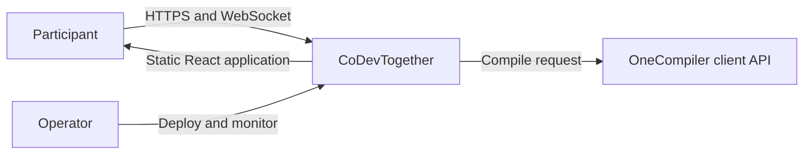
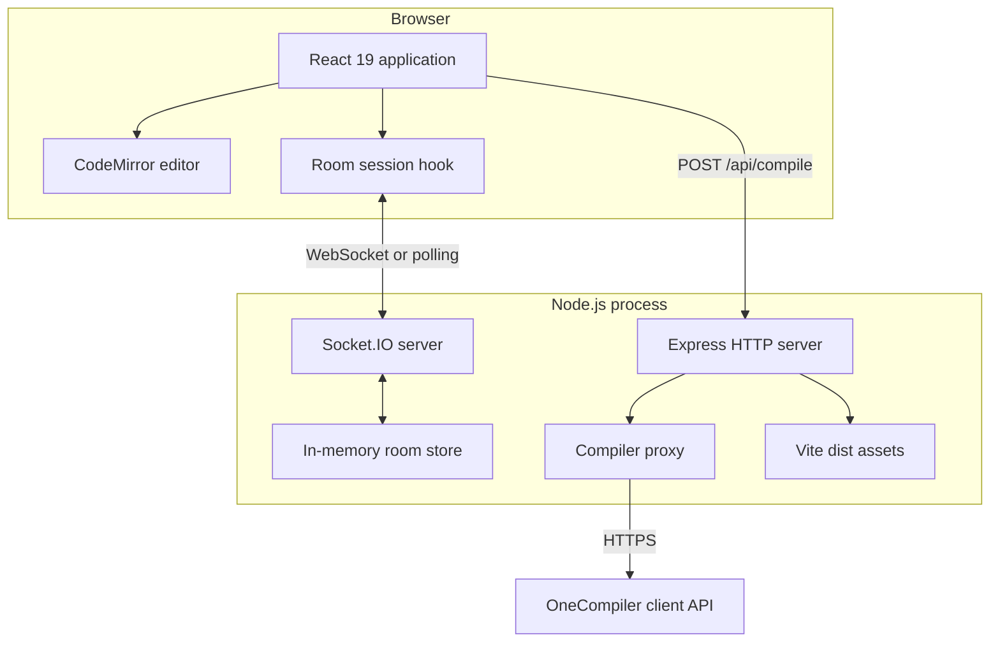
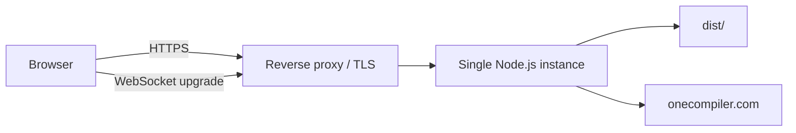
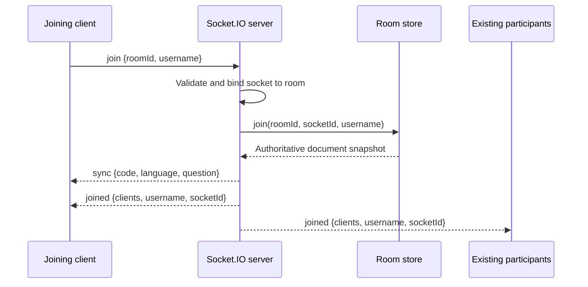
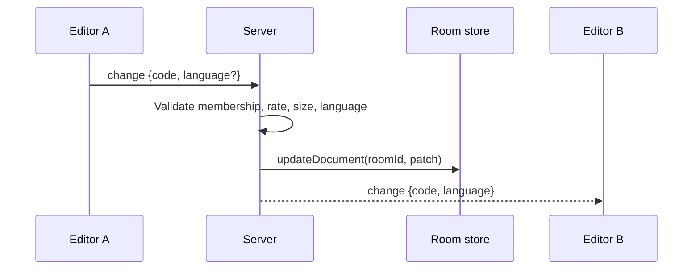
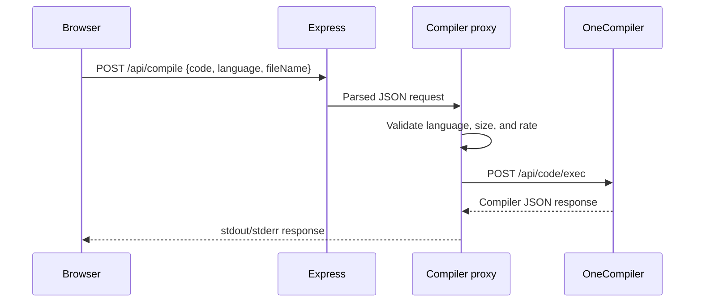

# CoDevTogether High-Level Design

[Back to README](../README.md) · [Low-Level Design](LLD.md)

## 1. Purpose

CoDevTogether is a browser-based collaborative coding workspace. Participants join a room through a shared identifier, edit one code document, maintain shared problem notes, exchange chat messages, publish presence, and execute code through a server-side compiler proxy.

This document describes system boundaries, major components, deployment, data movement, security, availability, and growth paths. Implementation contracts are documented in [LLD.md](LLD.md).

## 2. Goals and non-goals

### Goals

- Low-latency room collaboration over a persistent connection.
- One deterministic room snapshot for newly joined clients.
- A responsive interface that exposes all workspace features on mobile and desktop.
- Server-enforced room boundaries and input limits.
- Code execution through a separate upstream service rather than the web process.
- A small operational footprint suitable for one Node.js instance.

### Current non-goals

- User authentication or private-room authorization.
- Conflict-free concurrent editing through OT or CRDT algorithms.
- Durable room history, chat history, or code persistence.
- Multi-instance Socket.IO coordination.
- Hosting a code-execution sandbox inside this repository.

## 3. System context

The browser trusts CoDevTogether for application assets, room events, and compiler proxy responses. OneCompiler is an external trust boundary and receives user-supplied code.

## 4. Container architecture

| Container | Responsibility |
| --- | --- |
| React application | Routing, lobby, workspace state, responsive panels, chat, themes, and compiler presentation |
| CodeMirror | Editing surface, language extensions, autocompletion, and editor scrolling |
| Express | Health endpoint, compiler route, static assets, SPA fallback, and JSON error responses |
| Socket.IO | Connections, room membership, collaboration events, presence, and reconnect transport |
| Room store | Active room document and participant state for the current process |
| Compiler proxy | Request validation, rate limiting, upstream timeout, response-size limit, and OneCompiler forwarding |

## 5. Deployment model

The production build is created with `npm run build` and served from `dist/` by the same Node.js process that owns Socket.IO. A reverse proxy should terminate TLS and forward WebSocket upgrades on `/socket.io/`.

The current store is process-local, so deployment assumes one Node.js instance. Restarting the process removes all rooms.

## 6. Primary data flows

### 6.1 Join and synchronization

Only the server chooses the destination room after a successful join. Client-provided room identifiers on later events are ignored because membership is read from `socket.data`.

### 6.2 Collaborative edit

Edits are last-write-wins. The server stores a complete document snapshot and broadcasts complete code values rather than character operations.

### 6.3 Compilation

The browser aborts after ten seconds; the proxy aborts its upstream request after nine seconds. The server derives the filename from its own language metadata and does not trust the submitted filename.

## 7. Data ownership and lifecycle

| Data | Owner | Persistence | Lifecycle |
| --- | --- | --- | --- |
| Code, language, problem notes | Room store | Memory only | Created on first join; removed after last participant leaves |
| Participant name and focus | Room store and socket data | Memory only | Bound to a socket connection |
| Chat messages | Connected browsers | Client memory only | Capped at 200 messages per client; not replayed to new joiners |
| Theme | Browser | `localStorage` | Persists per browser |
| Username | Browser | `sessionStorage` | Persists across a room-page refresh in the tab |
| Resizable panel widths | Browser | `localStorage` | Persists per browser and is clamped to viewport limits |
| Compiler source | Browser, proxy, OneCompiler | Not stored by this application | Exists for the duration of the request |

## 8. Security architecture

### Trust boundaries

- Browser payloads are untrusted.
- Room identifiers are capability-style invite links, not authorization credentials.
- OneCompiler is an external service receiving untrusted source code.
- Reverse-proxy forwarding configuration is operationally trusted.

### Implemented controls

- Socket origin allow-list with same-host and localhost defaults.
- Socket membership stored server-side and checked before every room event.
- Type, format, length, and language validation.
- Socket event rate limits and a 256 KB transport buffer limit.
- Compiler request rate limit, JSON body limit, upstream timeout, and response-size limit.
- No server signature or internal error details returned to ordinary clients.
- Server-generated usernames, message types, activity text, and filenames.

### Residual risks

- Anyone with a room ID can join the room.
- In-memory rate limits reset on process restart and are not shared across instances.
- The compiler endpoint is public and can still be abused across many source IPs.
- The OneCompiler client endpoint is an external dependency whose contract can change.
- Collaboration is not encrypted unless TLS is configured at the deployment edge.

## 9. Availability and failure behavior

| Failure | Current behavior |
| --- | --- |
| Temporary socket disconnect | Client enters `reconnecting`; Socket.IO retries and rejoins on `connect` |
| Server restart | Connections retry, but active room documents are lost |
| Compiler timeout | Proxy returns `502`; UI displays a timeout error |
| Compiler malformed or oversized response | Proxy returns a sanitized `502` |
| Invalid or oversized socket payload | Event is ignored or a room error is emitted |
| Unsupported browser width | Mobile tab layout retains code, notes, output, chat, and participant access |

## 10. Scalability roadmap

To scale beyond one process:

1. Add authenticated users and room-level authorization.
2. Move room snapshots and presence to a shared store.
3. Add the Socket.IO Redis adapter for cross-instance broadcasts.
4. Replace last-write-wins documents with a CRDT such as Yjs.
5. Persist selected room versions and optionally chat history.
6. Move compiler rate limiting to a shared gateway or Redis-backed limiter.
7. Add structured logs, metrics, tracing, and upstream dependency alerts.

## 11. Architectural decisions

| Decision | Benefit | Trade-off |
| --- | --- | --- |
| One Node.js process | Simple deployment and same-origin networking | No horizontal scale or durable rooms |
| Authoritative server snapshot | Deterministic joins and simpler clients | Last-write-wins concurrent editing |
| Shared event constants | Client/server protocol consistency | JavaScript does not provide compile-time schema checking |
| Same-origin compiler proxy | No browser CORS dependency; centralized limits | Server absorbs compiler traffic and upstream risk |
| Feature-based React structure | Localizes room, editor, chat, and lobby behavior | Some shared protocol imports cross client/server boundaries |
| Lazy-loaded room/editor | Fast landing-page bundle | First room/editor load requires an additional chunk |
